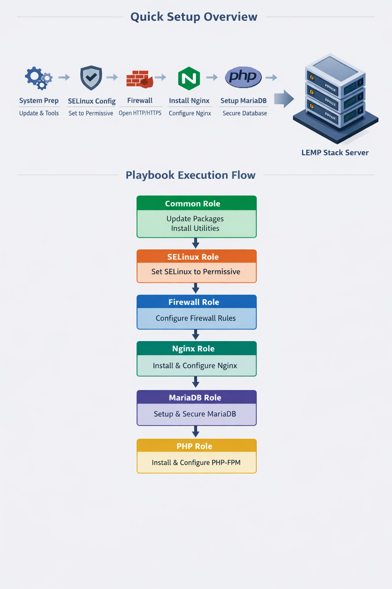

# Ansible LEMP Stack Automation

## Overview
This repository provides a **fully automated Ansible solution** for provisioning a Linux server with a complete **LEMP stack**:

- **Linux**
- **Nginx**
- **MariaDB**
- **PHP 8 (PHP-FPM)**

It is designed using **role-based Ansible architecture**, templates, handlers, and variables.  
The playbook converts a **fresh server** into a **production-ready web server** in a **repeatable, idempotent manner**, following real-world DevOps practices.

---

## Prerequisites

Before running this Ansible project, the target system must meet the following requirements:

### Operating System
- RHEL 9 / Rocky Linux 9 / AlmaLinux 9 / CentOS Stream 9
- Root or sudo privileges on the target host

### Ansible & Core Dependencies
Install Ansible and Python runtime:

```bash
dnf install -y ansible-core python3 python3-libselinux

Reason:

Ansible modules run via Python

SELinux-related modules require python3-libselinux

Network & Access

Internet access to download packages and repositories

SSH access to the target server (for remote execution)

Package Repositories

Required for PHP 8:

dnf install -y epel-release
dnf install -y https://rpms.remirepo.net/enterprise/remi-release-9.rpm

## Packages Installed by Playbook

Web Server: nginx

Database: mariadb-server

Database Python Module: python3-PyMySQL

PHP Runtime: php, php-fpm

PHP Extensions: php-mysqlnd, php-cli, php-gd, php-curl, php-mbstring, php-xml, php-zip

Firewall: firewalld

Utilities: vim, curl, wget, unzip

Services Managed by Playbook

nginx

mariadb

php-fpm

firewalld

SELinux

SELinux is enabled by default on RHEL-based systems

This playbook sets it to permissive and applies required booleans for web application compatibility

Production Note: Use custom SELinux policies instead of permissive mode

## Repository Structure:

ansible-lemp-stack/
├── inventory
├── playbook.yml
├── group_vars/
│   └── all.yml
├── roles/
│   ├── common/
│   │   └── tasks/main.yml
│   ├── selinux/
│   │   └── tasks/main.yml
│   ├── firewall/
│   │   ├── tasks/main.yml
│   │   └── handlers/main.yml
│   ├── nginx/
│   │   ├── tasks/main.yml
│   │   ├── handlers/main.yml
│   │   └── templates/nginx.conf.j2
│   ├── mariadb/
│   │   └── tasks/main.yml
│   └── php/
│       ├── tasks/main.yml
│       └── handlers/main.yml
├── diagrams/
│   └── ansible-lemp-flow.png
└── README.md


## Execution Flow

The playbook configures the server in the following logical order:

System Preparation – Updates packages and installs essential utilities

SELinux Configuration – Sets permissive mode to avoid permission conflicts

Firewall Setup – Installs and configures firewalld, opens HTTP/HTTPS

Nginx Installation – Installs, configures, and starts Nginx with PHP-FPM integration

MariaDB Installation – Installs, secures, and starts MariaDB server

PHP Installation – Installs PHP 8, extensions, and configures PHP-FPM

Validation – Ensures services are running and PHP is processed correctly


Inventory Example
[webserver]
your_server_ip ansible_user=shiyas ansible_become=true


Local testing:

[webserver]
localhost ansible_connection=local

Variables

Global variables are defined in group_vars/all.yml:

mariadb_root_password: StrongRootPass@123


Security Note: Sensitive values should be encrypted using Ansible Vault in production environments.

Running the Playbook
ansible-playbook -i inventory playbook.yml


Idempotent: safe to re-run multiple times

Automatically installs and configures all services

## Validation & Testing

Check services:

systemctl status nginx mariadb php-fpm firewalld


PHP test:

echo "<?php phpinfo(); ?>" | sudo tee /usr/share/nginx/html/info.php


Open in browser:

http://server_ip/info.php

##Use Cases

Automated provisioning of fresh Linux servers

Standardized LEMP environments

Base platform for WordPress or PHP applications

## 📊 Project Flow Diagram

The following diagram shows the execution flow of the Ansible-based LEMP stack automation:


